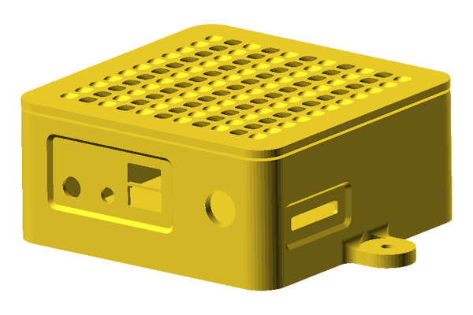
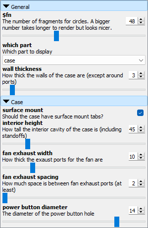

# OpenSCAD NUC5PPYB Case

  

This is a case for the Intel NUC5PPYB kit. The case can be printed with or without mounting tabs (for mounting to a flat surface) and with a range of wall thicknesses.

Many parameters are configurable via the customizer without editing any code.

  

## Design Considerations

This case features a partition between the exhaust side of the fan and the intake side. The intent is to prevent fresh air from mixing with exhaust air to maximize the efficiency of the cooling solution. The orientation of the board affords easy access to the RAM slot and the SATA connector with the lid open. The lid is heavily perforated to allow for passive cooling of the cooler components.

Due to the orientation of the motherboard, this case does not have an integrated power button. Instead, a hole on the right side of the front panel is available for a dedicated power button. This can either be a simple momentary NO switch or a fancier switch with integrated LEDs to indicate power and drive activity.

If an internal HDD is desired, the lid can be printed with mounts. These mounts hold a 70mm wide 2.5" hard disk in place (5mm or thicker) with rubber bands. To install an HDD internally, the internal case height should be increased to 45mm or more to allow for sufficient clearance. If your hard disk is longer than 100mm or if your particular SATA cables do not fit in the case, SATA cables can be routed out of the case via cable holes and the hard disk can be mounted externally.

There are no dividers between the top and bottom USB ports. These dividers are fragile when printed and serve little practical or aesthetic purpose.
